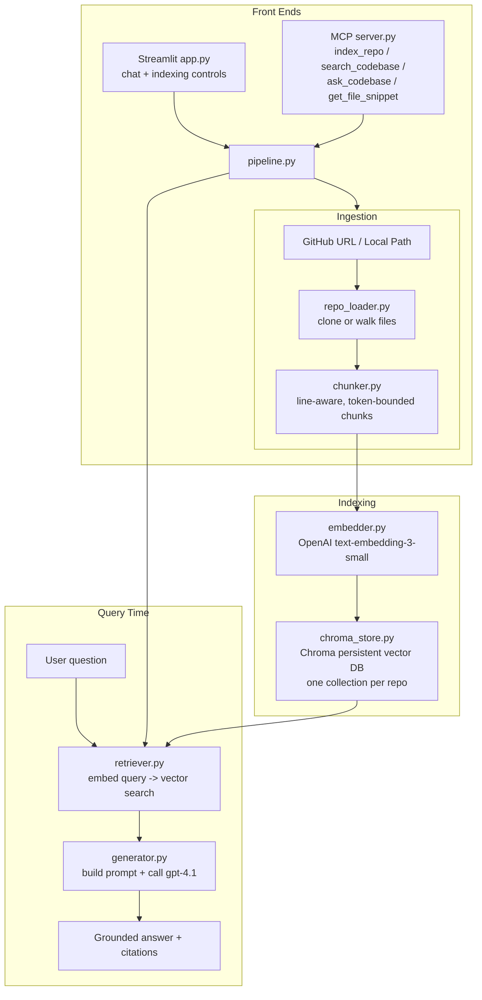

# RepoMind

**RepoMind** is a RAG-powered assistant that lets you index any GitHub repo (or local codebase)
and ask natural-language questions about it — with answers grounded in the actual source,
citing exact files and line ranges.

Stack: **Python · RAG (Chroma + OpenAI embeddings) · MCP tools · Streamlit · OpenAI `gpt-4.1`**

---

## 1. Architecture



**Flow in words:**
1. **Ingest** — `repo_loader.py` clones a GitHub URL (via GitPython, shallow clone) or reads a
   local folder, filtering to real source-code extensions and skipping `node_modules`, `.git`, etc.
2. **Chunk** — `chunker.py` splits each file into ~1200-token, line-aligned chunks with ~200-token
   overlap, so context never breaks mid-statement.
3. **Embed & store** — `embedder.py` calls OpenAI's embeddings endpoint in batches;
   `chroma_store.py` persists vectors + metadata (file path, line range) in a local Chroma DB,
   one collection per repo, so multiple repos coexist.
4. **Retrieve** — `retriever.py` embeds the user's question and does a similarity search against
   the active repo's collection.
5. **Generate** — `generator.py` builds a grounded prompt (system rules + retrieved chunks +
   question + chat history) and calls **`gpt-4.1`** via the OpenAI Chat Completions API.
6. **Serve** — two front ends share the same `pipeline.py` orchestration layer:
   - **Streamlit** (`app.py`) — a chat UI for humans, with an indexing sidebar and source citations.
   - **MCP server** (`src/mcp_server/server.py`) — exposes `index_repo`, `search_codebase`,
     `ask_codebase`, and `get_file_snippet` as tools any MCP client (Claude Desktop, Claude Code,
     etc.) can call directly.

---

## 2. Folder structure

```
RepoMind/
├── app.py                        # Streamlit chat UI (entry point)
├── config.py                     # Central settings, loaded from .env
├── requirements.txt
├── .env.example                  # Copy to .env and fill in your key
├── README.md
├── data/
│   ├── repos/                    # Cloned repos land here
│   └── vector_db/                # Persisted Chroma vector DB
├── src/
│   ├── ingestion/
│   │   ├── repo_loader.py        # Clone / walk / read source files
│   │   └── chunker.py            # Token-aware, line-safe chunking
│   ├── embeddings/
│   │   └── embedder.py           # OpenAI embeddings wrapper (batched)
│   ├── vectorstore/
│   │   └── chroma_store.py       # Chroma persistent client, per-repo collections
│   ├── rag/
│   │   ├── retriever.py          # Vector search -> ranked chunks
│   │   ├── generator.py          # Prompt build + gpt-4.1 call
│   │   └── pipeline.py           # Orchestrates ingest -> index -> ask (shared by UI + MCP)
│   ├── mcp_server/
│   │   └── server.py             # FastMCP server exposing RepoMind as MCP tools
│   └── utils/
│       └── logger.py
└── tests/
    └── test_chunker.py
```

---

## 3. Setup

```bash
git clone <this-project>
cd RepoMind
python -m venv venv && source venv/bin/activate      # Windows: venv\Scripts\activate
pip install -r requirements.txt

cp .env.example .env
# then edit .env and set:
#   OPENAI_API_KEY=sk-...
#   OPENAI_CHAT_MODEL=gpt-4.1
```

## 4. Run the Streamlit app

```bash
streamlit run app.py
```

Then in the sidebar:
1. Paste a GitHub URL (e.g. `https://github.com/psf/requests`) or a local folder path.
2. Click **Index repo** — it clones (if remote), chunks, embeds, and stores vectors.
3. Select it as the active repo and start asking questions in the chat box.

## 5. Run the MCP server (optional)

To let Claude Desktop / Claude Code / any MCP client use RepoMind as a tool:

```bash
python -m src.mcp_server.server
```

Then add it to your MCP client's config, e.g. for Claude Desktop's `claude_desktop_config.json`:

```json
{
  "mcpServers": {
    "repomind": {
      "command": "python",
      "args": ["-m", "src.mcp_server.server"],
      "cwd": "/absolute/path/to/RepoMind"
    }
  }
}
```

Exposed tools: `index_repo`, `list_indexed_repos`, `search_codebase`, `ask_codebase`,
`get_file_snippet`.

## 6. Run tests

```bash
pytest tests/
```

---

## 7. Notes & extension ideas

- **Model**: generation uses `gpt-4.1` by default (`OPENAI_CHAT_MODEL` in `.env`); embeddings use
  `text-embedding-3-small` — swap either without touching code.
- **Swap vector DB**: `chroma_store.py` is the only file that knows about Chroma; swapping to
  FAISS/Pinecone/Weaviate means reimplementing that one module behind the same functions.
- **Bigger repos**: increase `CHUNK_SIZE`/lower `TOP_K` for speed vs. recall trade-offs; consider
  adding a re-ranking step in `retriever.py` for very large codebases.
- **Auth**: add a simple password gate in `app.py` (`st.text_input(type="password")`) before
  deploying publicly, since indexing costs OpenAI credits per use.
